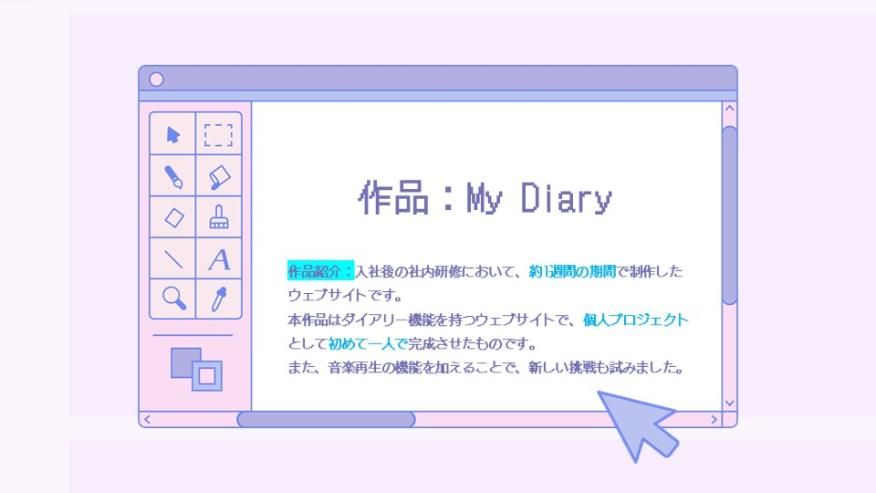
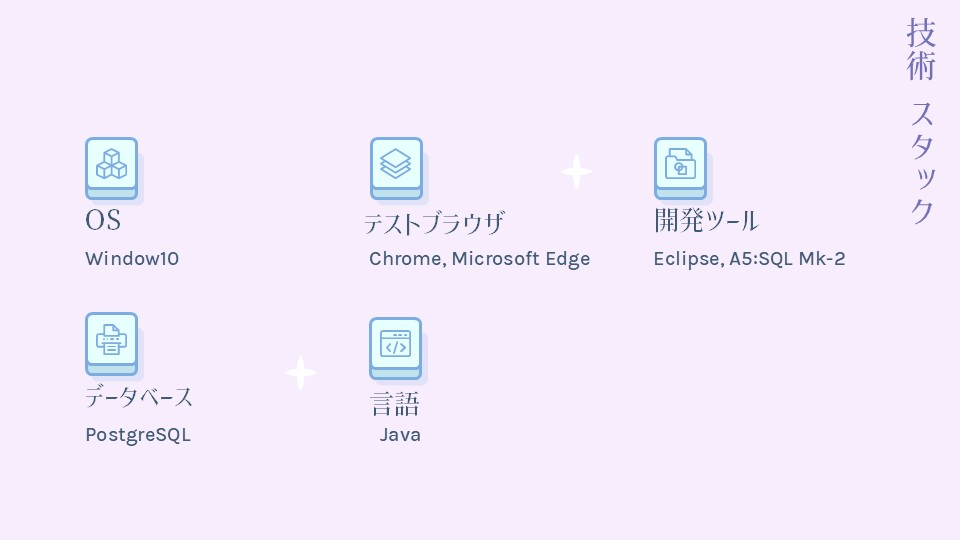
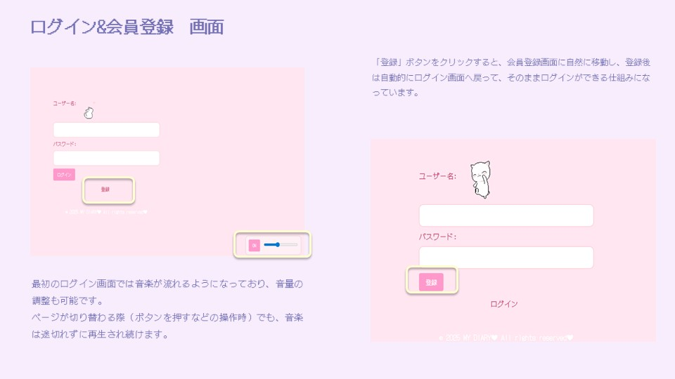
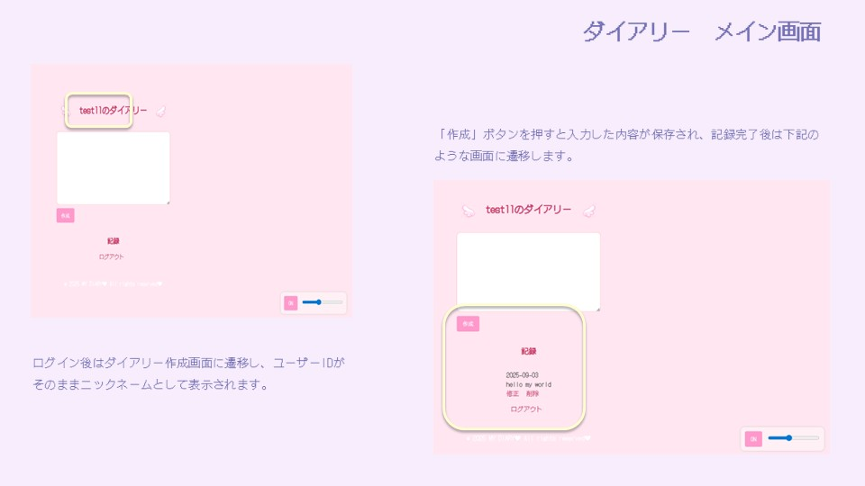
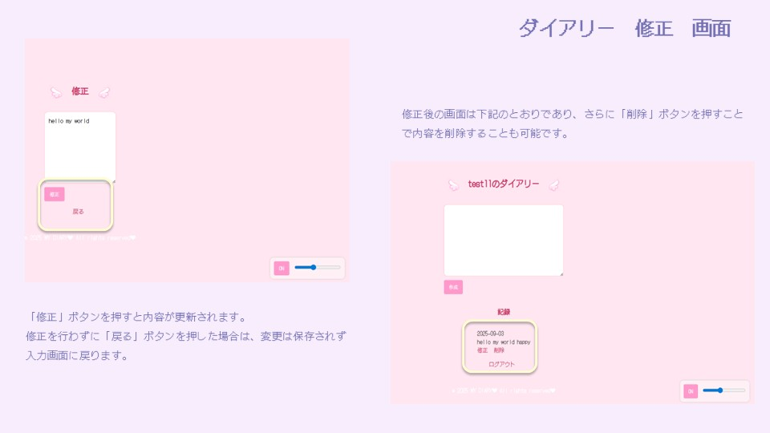
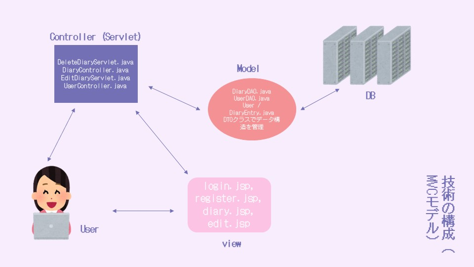
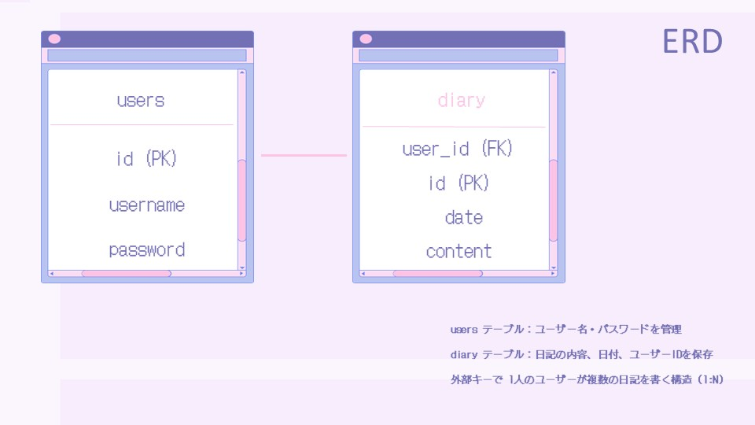
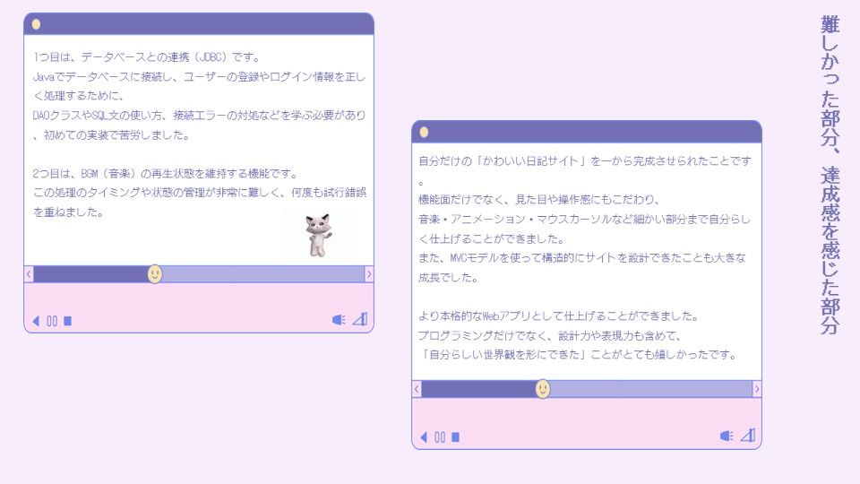

# Portfolio
Java

----

   
  <b>main</b>

   
  <b>技術 スタック</b>

   
  <b>ログイン&会員登録　画面</b>

   
  <b>ダイアリー　メイン画面</b>

   
  <b>ダイアリー　修正　画面</b>

   
  <b>技術の構成（MVCモデル）</b>

   
  <b>ERD</b>

   
  <b>難しかった部分、達成感を感じた部分</b>

